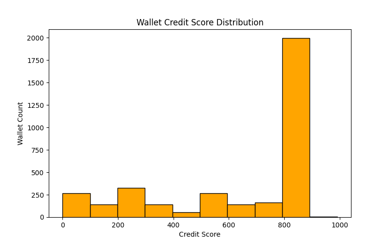

### Aave Wallet Credit Score Analysis

#### **Overview**

This report presents analysis of wallet behavior based on credit scores produced by our system from Aave V2 interaction patterns.

#### **Score Distribution Summary**

Histogram below shows the range of wallet credit scores:

Most of the wallets fall in the upper-middle class, reflecting wise handling of finances, though there exists a huge disparity across all classes.

#### **Score Range Behavioral Analysis**

###### **Score Range           Wallet Behavior Observed**

**0 - 250**       --->     These wallets are likely to experience liquidations or make withdrawals with little deposits. This behavior 				indicates exploitative use or uncontrolled risk.

**251 - 500**     --->     Here, excess leverage borrowing without matching repayment is common. Such wallets are risky in the middle segment 			and exhibit signs of unstable use.

**501 - 750**     --->     Balanced DeFi usage with high frequency of deposits and borrowing but with some late repayment or minor liquidation 			events. This level consists of average users with manageable risk.

**751 - 1000**    --->     These wallets always deposit, borrow in a prudent manner, repay in their entirety, and do not get liquidated. They 			are very dependable DeFi actors.

#### **Insights**

* **Healthy Wallets**: Regular deposits, controlled borrowing, timely repayments, and no liquidations.
* **Risky Wallets**: Overborrowing with poor repayment behavior or liquidations.
* **Red Flags**: Suspicious liquidation activity and wallets that cash out significantly more than they invest.

#### **Use Cases**

This scoring scale can help: 

* Identify wallets that can get discounted DeFi interest.
* Mark wallets for collateral update requirements. 
* Educate DeFi lending platforms on risk-based user segmentation.

#### **Conclusion:** 

The Aave Wallet Credit Scoring solution provides a clear and transparent way to assess user behavior in the form of real transactional data so as to give more informed decision-making in decentralized lending systems.

